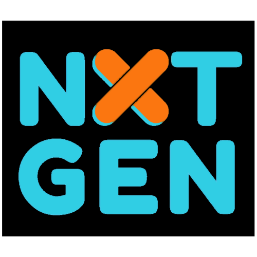

# NextGen - CCF NXTGen Children's Ministry Management System

<div align="center">
  
  
  <h1>🎯 NextGen</h1>
  <h3>CCF NXTGen Children's Ministry Management System</h3>
  
  <p><strong>A comprehensive management system designed exclusively for CCF NXTGen Children's Ministry</strong></p>
  
  [](https://github.com/Auguzcht/NextGen)
  [](#license)
  [](https://reactjs.org/)
  [](https://supabase.com/)
</div>

## 🌟 About NextGen

NextGen is a modern, full-featured children's ministry management system built specifically for **CCF NXTGen Ministry**. This platform streamlines attendance tracking, child registration, guardian management, staff assignments, email communications, and comprehensive reporting - all designed to enhance ministry operations and child safety.

### 🎯 Built For NXTGen Ministry

This system is exclusively designed and licensed for use by **Christ's Commission Fellowship (CCF) NXTGen Children's Ministry**. It incorporates ministry-specific workflows, age group structures, and operational requirements tailored to NXTGen's unique needs.

## ✨ Key Features

### 👶 Child & Family Management
- **Smart Registration System** - Streamlined child enrollment with automatic formal ID generation
- **Guardian Portal** - Complete family information management with relationship tracking  
- **Age-Based Categorization** - Automatic age group assignment (Preschool, Elementary 1, Elementary 2, Preteen)
- **Photo Management** - Secure child photo storage with Firebase integration

### 📊 Attendance & Check-In
- **Quick Check-In/Out** - Efficient attendance tracking with QR code support
- **Service Management** - Multiple service time tracking (First, Second, Third Service)
- **Real-time Analytics** - Live attendance metrics and growth tracking
- **Safety Protocols** - Secure child pickup verification system

### 👥 Staff & Volunteer Management
- **Role-Based Access** - Granular permissions for different ministry roles
- **Staff Assignments** - Service-specific volunteer scheduling
- **Profile Management** - Staff photo and contact information system
- **Authentication** - Secure login with Supabase Auth

### 📧 Communication Hub
- **Email Templates** - Pre-designed ministry communication templates
- **Batch Processing** - Mass email capabilities with personalization
- **Email Analytics** - Delivery tracking and engagement metrics
- **Guardian Notifications** - Automated parent communication system

### 📈 Analytics & Reporting
- **Weekly Reports** - Automated attendance summaries with PDF generation
- **Growth Tracking** - Trend analysis and ministry growth metrics
- **Age Group Analytics** - Demographic breakdowns and insights
- **Custom Dashboards** - Real-time ministry statistics

### 📚 Materials Management
- **Digital Resources** - File upload and organization system
- **Age-Appropriate Content** - Materials categorized by age groups
- **Google Drive Integration** - Cloud storage for ministry resources
- **Service Assignments** - Link materials to specific services

## 🛠 Technology Stack

### Frontend
- **React 18** - Modern React with hooks and functional components
- **Vite** - Lightning-fast build tool and dev server
- **Tailwind CSS** - Utility-first CSS framework for responsive design
- **Framer Motion** - Smooth animations and transitions
- **React Router** - Client-side routing and navigation

### Backend & Database
- **Supabase** - PostgreSQL database with real-time subscriptions
- **Row Level Security** - Database-level security policies
- **Edge Functions** - Serverless functions for complex operations
- **Real-time Sync** - Live data updates across all clients

### Integrations
- **Firebase Storage** - Secure photo and file storage
- **Google Drive API** - Cloud storage integration
- **Resend API** - Professional email delivery service
- **QR Code Generation** - For quick check-in processes

### Infrastructure
- **Vercel** - Production deployment and hosting
- **PostgreSQL** - Robust relational database
- **Edge Computing** - Global content delivery

## 🚀 Getting Started

### Prerequisites
- Node.js 18+ 
- npm or yarn package manager
- Git

### Installation

1. **Clone the repository**
   ```bash
   git clone https://github.com/Auguzcht/NextGen.git
   cd NextGen
   ```

2. **Install dependencies**
   ```bash
   npm install
   ```

3. **Environment Setup**
   Create a `.env.local` file in the root directory:
   
   ```env
   # Supabase Configuration
   VITE_SUPABASE_URL=your_supabase_project_url
   VITE_SUPABASE_ANON_KEY=your_supabase_anon_key
   
   # Firebase Configuration (for file storage)
   VITE_FIREBASE_API_KEY=your_firebase_api_key
   VITE_FIREBASE_AUTH_DOMAIN=your_project.firebaseapp.com
   VITE_FIREBASE_PROJECT_ID=your_project_id
   VITE_FIREBASE_STORAGE_BUCKET=your_project.appspot.com
   VITE_FIREBASE_MESSAGING_SENDER_ID=your_sender_id
   VITE_FIREBASE_APP_ID=your_app_id
   
   # Email Service (Server-side)
   RESEND_API_KEY=your_resend_api_key
   
   # Google Drive Integration
   GOOGLE_DRIVE_CLIENT_ID=your_google_client_id
   GOOGLE_DRIVE_CLIENT_SECRET=your_google_client_secret
   ```

4. **Start Development Server**
   ```bash
   npm run dev
   ```

### Production Deployment

```bash
# Build for production
npm run build

# Preview production build
npm run preview

# Deploy to Vercel (automatic via GitHub integration)
# or manual deployment: vercel --prod
```

## 📱 System Architecture

<div align="center">
  
</div>

### Architecture Overview

**Frontend Layer (React Application)**
- **Child Registration Component** - New child enrollment and family management
- **Dashboard Component** - Ministry statistics and quick actions
- **Reports Component** - Analytics and attendance reporting
- **Login Component** - Authentication and authorization
- **Attendance Component** - Check-in/check-out management
- **Email Communication Component** - Guardian and staff notifications

**State Management**
- **Child Data Store** - Child and guardian information
- **Attendance Store** - Check-in/out tracking
- **Authentication Store** - User sessions and permissions
- **UI State Store** - Component states and navigation

**Services Layer**
- **Validation Service** - Data integrity and form validation
- **Cache Service** - Performance optimization
- **QR Code Service** - Quick check-in functionality

**Backend Layer (API Controllers)**
- **Authentication Controller** - User login and session management
- **Attendance Controller** - Check-in/out business logic
- **Email Controller** - Communication workflows
- **Report Controller** - Analytics generation
- **Child Management Controller** - CRUD operations for children/guardians

**Business Logic Layer**
- **Authentication Service** - Login workflows and security
- **Attendance Service** - Check-in/out processing
- **Email Service** - Template processing and sending
- **Report Service** - Analytics calculation
- **Child Management Service** - Registration and updates

**Data Access Layer**
- **Attendance Repository** - Attendance data operations
- **Email Repository** - Communication logs
- **Staff Repository** - User and role management
- **Child Repository** - Child and guardian data
- **Guardian Repository** - Guardian information management

**External Services**
- **Resend Email API** - Professional email delivery
- **Firebase Cloud Messaging** - Push notifications
- **Supabase Authentication** - User management
- **Firebase Storage** - Photo and file storage

**Infrastructure**
- **Supabase Realtime** - Live data synchronization
- **Supabase Edge Functions** - Serverless backend logic
- **Database Backup Service** - Data protection
- **PostgreSQL Database** - Primary data store

## 🔧 Development

### Available Scripts

```bash
npm run dev          # Start frontend development server (port 3002)
npm run dev:api      # Start backend API server (port 3001)  
npm run dev:all      # Start both frontend and API servers concurrently
npm run build        # Build for production
npm run preview      # Preview production build
npm run lint         # Run ESLint code analysis
```

### Code Structure

```
src/
├── components/      # Reusable UI components
│   ├── auth/       # Authentication components
│   ├── children/   # Child management components
│   ├── email/      # Email system components
│   └── ui/         # Base UI components
├── pages/          # Application pages/routes
├── services/       # API and external service integrations
├── utils/          # Utility functions and helpers
├── hooks/          # Custom React hooks
└── context/        # React context providers
```

## 📄 License & Usage Rights

**⚠️ IMPORTANT: Proprietary License**

This software is the **exclusive property** of **Christ's Commission Fellowship (CCF) NXTGen Children's Ministry**. 

### Usage Rights
- ✅ **Authorized Use**: CCF NXTGen Ministry staff and authorized volunteers only
- ✅ **Ministry Operations**: Use for CCF NXTGen children's ministry management
- ✅ **Internal Development**: Modifications for ministry-specific needs

### Restrictions
- ❌ **No Redistribution**: Cannot be copied, distributed, or shared outside CCF NXTGen
- ❌ **No Commercial Use**: Cannot be used for commercial purposes
- ❌ **No Derivative Works**: Cannot be used as basis for other applications
- ❌ **No Public Access**: Source code is confidential and proprietary

### Copyright Notice
```
© 2025 Christ's Commission Fellowship (CCF) NXTGen Children's Ministry
All rights reserved. Unauthorized use, reproduction, or distribution is prohibited.
```

## 👨‍💻 Development Team

**Lead Developer**: Alfred Nodado  
**Ministry**: NXTGen Children's Ministry  
**Organization**: Christ's Commission Fellowship  

## 📞 Support & Contact

For technical support, feature requests, or ministry-specific questions:

- **Ministry Leadership**: Contact NXTGen ministry team
- **Technical Issues**: Create an issue in this repository (authorized users only)
- **Emergency Support**: Contact ministry administrators

---

<div align="center">
  <p><strong>Built with ❤️ for CCF NXTGen Children's Ministry</strong></p>
  <p><em>Empowering ministry through technology</em></p>
</div>
